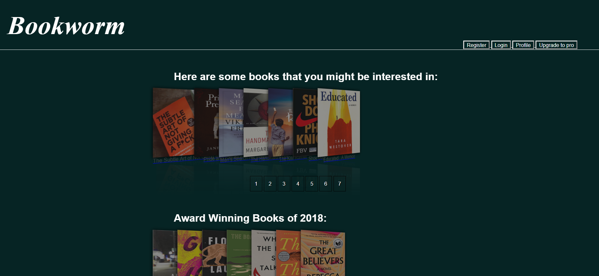
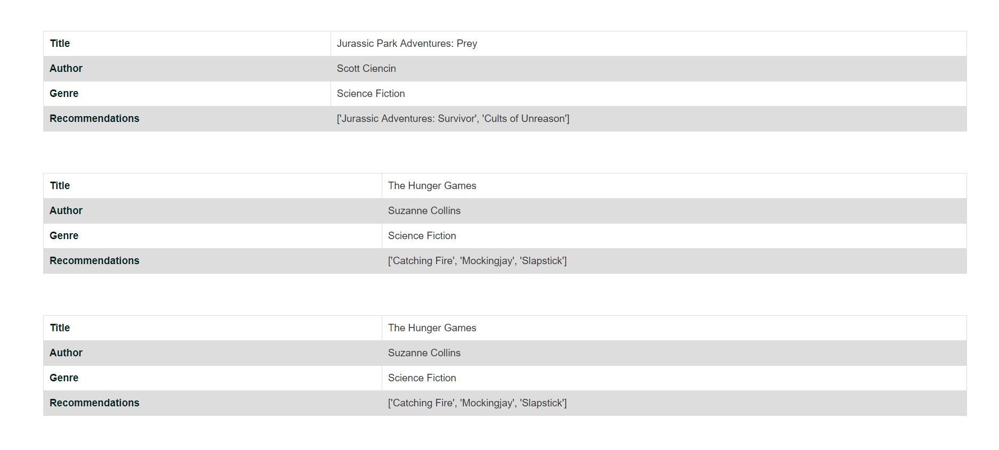
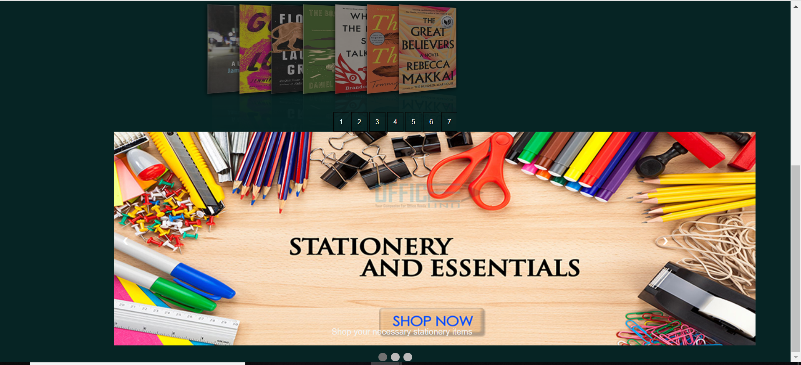

# Book Recommending System

 **Bookworm** is a content based book recommending system. It is a web application where the user can get new book recommendations based on the the books they have read. 

## Group: 02       course: cse299.17

|                |ID                          |Email                         |
|----------------|-------------------------------|-----------------------------|
|Ishrat Jahan Ananya|1631636042             |ishrat.jahan16@northsouth.edu        |
|Fatema Tuz Zohra          |1620191042            |Fatema.zohra01@northsouth.edu           |

<!-- TABLE OF CONTENTS -->
## Table of Contents

* [About the Project](#about-the-project)
* [Project Description](#project-description)
  * [Technology](#technology)
  * [Installations](#installations)
  * [Features](#features)
  *  [Recommendation algorithm](#recommendation-algorithm)
 
  * [Operating environment](#operating-environment)

* [Monetization](#monetization)
* [Links](#links)
* [Roadblocks](#roadblocks)

## About The Project

Technological advancement has open doors to a vast world of information. There are tons of books, articles and what not available at the palms of our hand. With great knowledge comes great responsibility and so as a book enthusiast many find it difficult to organize and keep track of all the books they have ever read. An avid reader is always on the lookout for new books to read and discover stories that suit their individual taste. This is where **‘Bookworm’** comes into play.

 Bookworm is a content-based book recommending system. It is a web application where the user can get new book recommendations based on the books they have read. It is accessible, user friendly, visually attractive web application that brings everything in one place. The user can make an organized library in their profile to keep track of all the books they read. This helps user know what they have read and make a Wishlist of the books they want to read in the future. The user will also be able to search for books by filters like genre, title, author etc. Best feature of Bookworm is that it will recommend books to the user based on their personal library with incredible accuracy!
 
 Here is the homepage
 

## Project Description
### Technology
 For the front-end that includes the web pages  and the back-end that includes the Database system and the recommendation script, Bookworm used the following technology:
* Django Framework
* HTML and CSS
* Javascript
* Python

### Installations
To setup the project, a few packages were installed. The list of which and their purpose is given below:
* Django-crispy-forms  -   for handling django forms
* numpy -  for recommendation script
* pandas library - for recommendation script
* pillow - For displaying profile pictures   
* scikit-learn - for recommendation script
* stripe - for payment method

### Features

1. Register – User will create an account by registering with their email address and password and would be able to edit account details.

2. Federated User Credentials - In addition to making their own accounts whose credentials are stored in the project’s database, users will have the option of using their Google accounts to log in. As Google is one of the largest and widely used platforms on the internet, many of our users may already have their own Google accounts. This would reduce the hassle for a new user of the website and improve ease of access.

3. Book library – User will have a library of books they have read in their profile. It is basically a list of books with their details found in the user’s profile. They can add, delete and edit accordingly.

4. Search engine – Users can search for books from a vast collection using filters like genre, title, author name etc.

5. Recommendation – Users will be recommended new books to read that are similar to the books they have in their library.

6. Admin – An admin account will be there for the creators to add more books to the collection or remove any if necessary. The admin will also be able to access the database and user’s information.

### Recommendation Algorithm

Bookworm will recommend based on content which means books with similar plotline are likely to be recommended by our algorithm. For the purpose of this project we are using the ‘CMU book summary’ dataset that has a large collection of books including some metadata such as author, publisher and genre etc and also a short description of the book extracted from the Wikipedia. We will first clean out the data and then train this data to filter out important ‘words’ from the description attribute using natural language processing techniques. To do this we find the TF-IDF (term frequency–inverse document frequency) and then apply the cosine similarity on it to get the desired results. Cosine similarity is basically a metric system used to determine the similarities between datasets irrespective of their sizes. This is mainly done by counting maximum number of common words between the documents in comparison.Based on this 3 books are recommended that has the closest similarity to the given book.

### Operating Environment

As it is a webpage, this product can be used on all desktop and mobile operating systems that support the use of a web browser. This product should function properly in all major web browsers including but not limited to Internet Explorer, Microsoft Edge, Google Chrome, Mozilla Firefox, Opera etc.

## Monetization

Bookworm will allow user to register and create their personal library of books read and discover many more in our vast collection. We will monetize this web application by displaying relevant advertisements on the side panels of the website. In order to get rid of these advertisements and use the recommender and other features the user have to pay a monthly subscription. The payment procedure can be done through Bkash or credit card. Users can also donate a certain amount of money for further development of the site or the Bookworm community. These ensures the continuous monetary support for the product.

## Roadblocks
1. Federated User Credentials -  Due to time limit we couldnt include the feature of allowing user to register/sign up with their Google or Facebook account

## Links
Project repository : [https://github.com/coreprinciple97/SU19CSE299S17G02NSU](https://github.com/coreprinciple97/SU19CSE299S17G02NSU)

Slack Channel : https://su19cse299nsusas3.slack.com/

